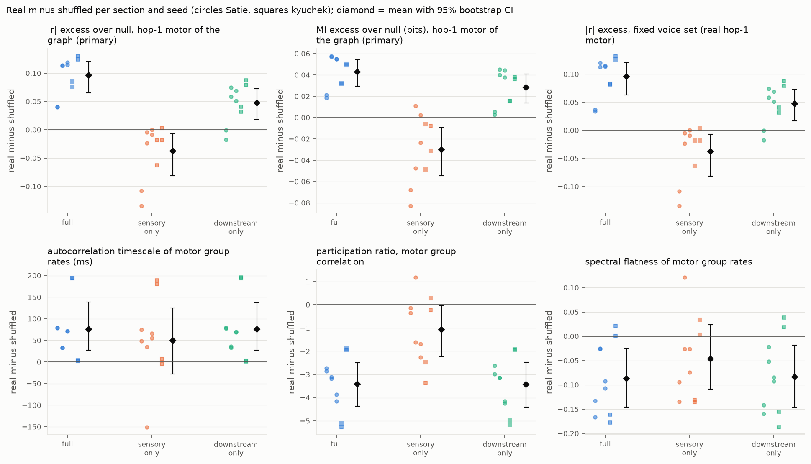
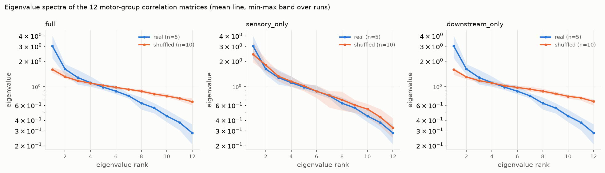
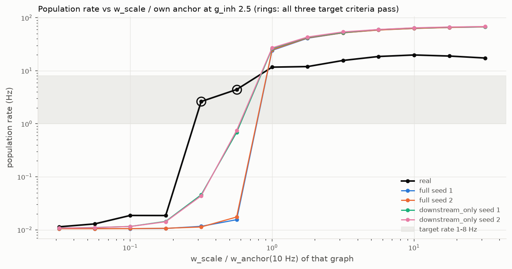
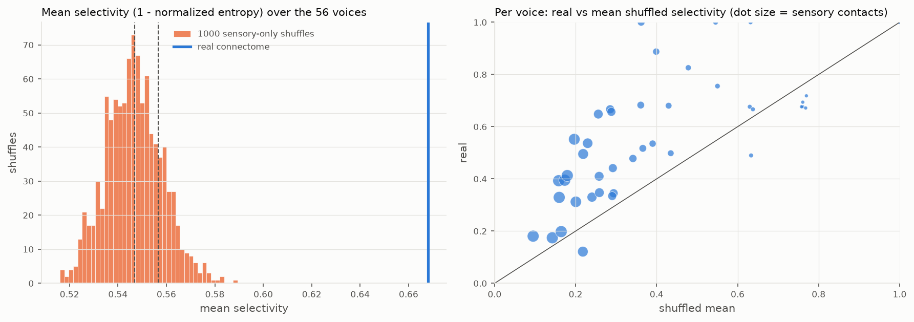
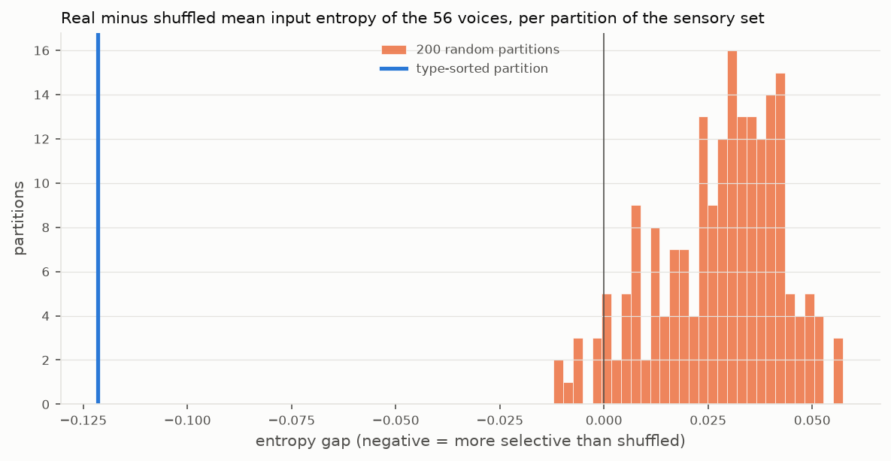

# Shuffle control: real connectome vs degree-preserving random graphs

Generated 2026-09-17T15:43:18+00:00 by `experiments/shuffle_control.py`; raw numbers in `cache/shuffle_control_results.json`.

## Design (fixed before running)

- Materials and replicate sections (chosen from the audio alone): Gymnopedie_No_1.flac: 31-51 s, 132-152 s, 79-99 s; kyuchek.mp3: 15-35 s, 2-22 s
- Conditions: full, sensory_only, downstream_only; seeds [1, 2]; one shuffled matrix per condition and seed, the same matrix for every section.
- Shuffle: each presynaptic neuron keeps its out-degree, outgoing weights and sign; targets are a permutation of the selected edges' target stubs (in-degrees kept), self-loops and duplicate pairs repaired by swaps. Verified after every shuffle.
- Identical drive, calibration and noise seed for real and shuffled runs (paired).
- Primary transmission measure: hop-1 motor neurons of each graph (its own BFS from the sensory set). The fixed voice set (the real graph's hop-1 motor neurons) is also reported; under a shuffle that moves the sensory edges those neurons are no longer necessarily direct targets.
- Dynamics measures on the 12 type-ordered groups of all 1,322 motor neurons.
- Effect = mean over sections of (real - mean over seeds); 95% CI by section/seed bootstrap (10000 resamples); exact permutation p over reassignments of the real label within sections; effect size = effect / pooled within-section SD of the shuffled runs. "Differs" requires p < 0.05 and a CI excluding 0. No correction for the number of measures is applied in the flag; see the table.

## Budget and cuts

5 sections (Gymnopedie_No_1.flac: 3, kyuchek.mp3: 2) x (1 real + 3 conditions x 2 seeds) = 35 runs, 2 already cached, 33 to simulate at ~3.35 min each (20.2 s at ~9.3 ms/step plus loading) = ~111 min against a 120 min budget. Cut: a third shuffle seed (would add 15 runs, ~50 min); a third kyuchek section is not available (a 37.6 s clip with 2 s margins cannot hold three 20 s sections overlapping by <= 50%). Actual simulation time of the main run: 123.7 min (3.75 min per run, above the 3.35 min estimate).

## Shuffle verification

| condition | seed | edges re-targeted | initial conflicts | repair iterations | targets unchanged | self-loops real -> shuffled |
|---|---|---|---|---|---|---|
| full | 1 | 15,075,807 | 35,359 | 4 | 0.00% | 69 -> 0 |
| full | 2 | 15,075,807 | 35,473 | 4 | 0.00% | 69 -> 0 |
| sensory_only | 1 | 4,494 | 358 | 8 | 0.45% | 69 -> 69 |
| sensory_only | 2 | 4,494 | 349 | 8 | 0.36% | 69 -> 69 |
| downstream_only | 1 | 15,071,313 | 35,482 | 5 | 0.00% | 69 -> 0 |
| downstream_only | 2 | 15,071,313 | 35,596 | 5 | 0.00% | 69 -> 0 |

All shuffles passed: in- and out-degree sequences unchanged, per-neuron outgoing weight multisets unchanged, one sign per presynaptic neuron, no duplicate pairs, unselected edges identical.

## Hop-1 motor sets

| graph | hop-1 motor neurons (own) | voices still at hop 1 |
|---|---|---|
| real | 56 | 56 of 56 |
| full s1 | 101 | 8 of 56 |
| full s2 | 93 | 5 of 56 |
| sensory_only s1 | 56 | 56 of 56 |
| sensory_only s2 | 56 | 56 of 56 |
| downstream_only s1 | 56 | 56 of 56 |
| downstream_only s2 | 56 | 56 of 56 |

## Per-run values

| section | graph | pop Hz | motor Hz | own hop-1 active | |r| excess own | MI excess own | |r| z own | MI z own | |r| excess voices | ACF tau ms | lambda1 frac | participation | flatness |
|---|---|---|---|---|---|---|---|---|---|---|---|---|---|
| Gymnopedie_No_1 31s | real | 5.22 | 9.47 | 17 | 0.0429 | 0.018 | 2.26 | 3.27 | 0.0429 | 126 | 0.206 | 8.49 | 0.685 |
| Gymnopedie_No_1 31s | full s1 | 34.5 | 27.3 | 71 | 0.00221 | -0.000298 | 0.525 | -0.287 | 0.00607 | 47.1 | 0.129 | 11.3 | 0.818 |
| Gymnopedie_No_1 31s | full s2 | 35 | 28.9 | 58 | 0.00324 | -0.00298 | 0.766 | -2.36 | 0.00919 | 46.3 | 0.14 | 11.2 | 0.851 |
| Gymnopedie_No_1 31s | sensory_only s1 | 5.4 | 9.27 | 19 | 0.177 | 0.0861 | 8.07 | 12.8 | 0.177 | 77.5 | 0.208 | 8.85 | 0.779 |
| Gymnopedie_No_1 31s | sensory_only s2 | 4 | 9.6 | 19 | 0.151 | 0.101 | 6.53 | 11.5 | 0.151 | 51.4 | 0.223 | 8.63 | 0.82 |
| Gymnopedie_No_1 31s | downstream_only s1 | 36 | 30.1 | 46 | 0.0604 | 0.0152 | 5.68 | 7.32 | 0.0604 | 48.2 | 0.14 | 11.1 | 0.826 |
| Gymnopedie_No_1 31s | downstream_only s2 | 36.9 | 32.6 | 50 | 0.0436 | 0.0124 | 4.95 | 9.55 | 0.0436 | 46.8 | 0.115 | 11.5 | 0.844 |
| Gymnopedie_No_1 132s | real | 4.41 | 9.44 | 19 | 0.117 | 0.0567 | 6.84 | 9.56 | 0.117 | 80.9 | 0.249 | 8.09 | 0.821 |
| Gymnopedie_No_1 132s | full s1 | 34.5 | 27.2 | 72 | 0.00233 | -0.000133 | 0.553 | -0.131 | 0.00349 | 47.8 | 0.122 | 11.3 | 0.847 |
| Gymnopedie_No_1 132s | full s2 | 34.9 | 28.8 | 59 | 0.00305 | -0.00117 | 0.706 | -1.11 | -0.00358 | 47.4 | 0.141 | 11.2 | 0.848 |
| Gymnopedie_No_1 132s | sensory_only s1 | 4.24 | 9.36 | 21 | 0.121 | 0.0458 | 5.93 | 6.85 | 0.121 | 232 | 0.278 | 6.92 | 0.7 |
| Gymnopedie_No_1 132s | sensory_only s2 | 4.01 | 9.72 | 20 | 0.14 | 0.104 | 4.83 | 11.8 | 0.14 | 46.2 | 0.163 | 9.7 | 0.848 |
| Gymnopedie_No_1 132s | downstream_only s1 | 36 | 30 | 48 | 0.0582 | 0.0166 | 6.33 | 6.94 | 0.0582 | 45.1 | 0.137 | 11.2 | 0.873 |
| Gymnopedie_No_1 132s | downstream_only s2 | 36.9 | 32.6 | 50 | 0.0422 | 0.0113 | 5.59 | 6.3 | 0.0422 | 48.2 | 0.136 | 11.2 | 0.843 |
| Gymnopedie_No_1 79s | real | 4.15 | 9.98 | 22 | 0.118 | 0.0559 | 4.97 | 5.83 | 0.118 | 117 | 0.293 | 7.06 | 0.759 |
| Gymnopedie_No_1 79s | full s1 | 34.5 | 27.3 | 72 | -0.00165 | 0.00098 | -0.347 | 0.71 | 0.00416 | 46 | 0.139 | 11.2 | 0.851 |
| Gymnopedie_No_1 79s | full s2 | 35 | 28.9 | 58 | 0.00297 | 0.00108 | 0.594 | 1.04 | 0.00307 | 45.3 | 0.143 | 10.9 | 0.866 |
| Gymnopedie_No_1 79s | sensory_only s1 | 4.01 | 9.38 | 20 | 0.127 | 0.0536 | 6.22 | 6.95 | 0.127 | 61.9 | 0.218 | 8.76 | 0.785 |
| Gymnopedie_No_1 79s | sensory_only s2 | 5.44 | 9.61 | 23 | 0.117 | 0.0795 | 7.44 | 9.71 | 0.117 | 51 | 0.201 | 9.33 | 0.834 |
| Gymnopedie_No_1 79s | downstream_only s1 | 36 | 30.1 | 47 | 0.0667 | 0.0181 | 7.29 | 7.7 | 0.0667 | 48 | 0.13 | 11.3 | 0.843 |
| Gymnopedie_No_1 79s | downstream_only s2 | 36.9 | 32.7 | 50 | 0.0489 | 0.0114 | 9.72 | 7.64 | 0.0489 | 47.3 | 0.138 | 11.2 | 0.851 |
| kyuchek 15s | real | 4.79 | 10.1 | 24 | 0.0864 | 0.0314 | 6.04 | 9.22 | 0.0864 | 241 | 0.336 | 6.2 | 0.676 |
| kyuchek 15s | full s1 | 34.5 | 27.2 | 73 | 0.00133 | -0.000294 | 0.416 | -0.254 | 0.00353 | 47.3 | 0.122 | 11.5 | 0.837 |
| kyuchek 15s | full s2 | 35 | 28.8 | 58 | 0.0101 | -0.000922 | 2.25 | -0.901 | 0.00519 | 47.2 | 0.129 | 11.3 | 0.854 |
| kyuchek 15s | sensory_only s1 | 3.93 | 8.89 | 19 | 0.105 | 0.0376 | 8.2 | 13.8 | 0.105 | 60.4 | 0.189 | 8.68 | 0.811 |
| kyuchek 15s | sensory_only s2 | 4.04 | 9.52 | 22 | 0.149 | 0.08 | 15.2 | 29.9 | 0.149 | 52.6 | 0.168 | 9.56 | 0.807 |
| kyuchek 15s | downstream_only s1 | 36 | 29.9 | 47 | 0.0546 | 0.0162 | 12.3 | 9.41 | 0.0546 | 45.3 | 0.137 | 11.2 | 0.863 |
| kyuchek 15s | downstream_only s2 | 36.9 | 32.7 | 50 | 0.0459 | 0.0157 | 10.4 | 10.8 | 0.0459 | 47.3 | 0.131 | 11.4 | 0.831 |
| kyuchek 2s | real | 4.6 | 9.36 | 19 | 0.132 | 0.0503 | 11.6 | 16.9 | 0.132 | 49.2 | 0.181 | 9.32 | 0.869 |
| kyuchek 2s | full s1 | 34.5 | 27.3 | 72 | 0.00747 | -0.000368 | 2.5 | -0.387 | 0.00586 | 45.6 | 0.132 | 11.3 | 0.868 |
| kyuchek 2s | full s2 | 35 | 28.9 | 58 | 0.00146 | 0.00134 | 0.403 | 1.2 | -0.000541 | 47.1 | 0.138 | 11.2 | 0.848 |
| kyuchek 2s | sensory_only s1 | 3.77 | 8.84 | 18 | 0.129 | 0.058 | 11.7 | 19.4 | 0.129 | 42.6 | 0.183 | 9.55 | 0.865 |
| kyuchek 2s | sensory_only s2 | 4.04 | 9.77 | 21 | 0.151 | 0.0813 | 10.5 | 24.3 | 0.151 | 53.8 | 0.183 | 9.04 | 0.835 |
| kyuchek 2s | downstream_only s1 | 36 | 30 | 46 | 0.0528 | 0.0124 | 10.8 | 9.12 | 0.0528 | 47.8 | 0.131 | 11.2 | 0.831 |
| kyuchek 2s | downstream_only s2 | 36.8 | 32.5 | 50 | 0.0447 | 0.0142 | 7.3 | 12.6 | 0.0447 | 46.4 | 0.135 | 11.3 | 0.85 |

## Effects: real minus shuffled

### full

| measure | real mean | shuffled mean | effect (real - shuffled) | 95% CI | permutation p | effect size | sections | differs |
|---|---|---|---|---|---|---|---|---|
| |r| excess over null, hop-1 motor of the graph (primary) | 0.0991 | 0.00325 | +0.0958 | [+0.0651, +0.121] | 0.00412 (of 243) | 26 | 5 | **yes** |
| MI excess over null (bits), hop-1 motor of the graph (primary) | 0.0425 | -0.000277 | +0.0427 | [+0.0294, +0.0547] | 0.00412 (of 243) | 39.7 | 5 | **yes** |
| |r| z, hop-1 motor of the graph | 6.35 | 0.837 | +5.51 | [+3.15, +8.1] | 0.00412 (of 243) | 5.9 | 5 | **yes** |
| MI z, hop-1 motor of the graph | 8.97 | -0.247 | +9.21 | [+5.7, +13.1] | 0.00412 (of 243) | 10.1 | 5 | **yes** |
| |r| excess, fixed voice set (real hop-1 motor) | 0.0991 | 0.00364 | +0.0954 | [+0.0626, +0.121] | 0.00412 (of 243) | 29.5 | 5 | **yes** |
| MI excess (bits), fixed voice set | 0.0425 | 0.000563 | +0.0419 | [+0.0283, +0.054] | 0.00412 (of 243) | 17.8 | 5 | **yes** |
| autocorrelation timescale of motor group rates (ms) | 123 | 46.7 | +76.1 | [+27, +139] | 0.00412 (of 243) | 129 | 5 | **yes** |
| largest eigenvalue fraction, motor group correlation | 0.253 | 0.133 | +0.119 | [+0.0714, +0.171] | 0.00412 (of 243) | 15.8 | 5 | **yes** |
| participation ratio, motor group correlation | 7.83 | 11.2 | -3.41 | [-4.37, -2.5] | 0.00412 (of 243) | -29.6 | 5 | **yes** |
| spectral flatness of motor group rates | 0.762 | 0.849 | -0.0869 | [-0.146, -0.0256] | 0.0123 (of 243) | -6.16 | 5 | **yes** |
| whole-network population rate (Hz) | 4.63 | 34.7 | -30.1 | [-30.4, -29.8] | 0.00412 (of 243) | -92 | 5 | **yes** |
| motor population rate (Hz) | 9.68 | 28.1 | -18.4 | [-19, -17.8] | 0.00412 (of 243) | -16 | 5 | **yes** |

### sensory_only

| measure | real mean | shuffled mean | effect (real - shuffled) | 95% CI | permutation p | effect size | sections | differs |
|---|---|---|---|---|---|---|---|---|
| |r| excess over null, hop-1 motor of the graph (primary) | 0.0991 | 0.137 | -0.0377 | [-0.0817, -0.00683] | 0.0165 (of 243) | -2 | 5 | **yes** |
| MI excess over null (bits), hop-1 motor of the graph (primary) | 0.0425 | 0.0727 | -0.0302 | [-0.0547, -0.00926] | 0.0576 (of 243) | -1.17 | 5 | no |
| |r| z, hop-1 motor of the graph | 6.35 | 8.47 | -2.12 | [-4.96, +0.417] | 0.169 (of 243) | -0.9 | 5 | no |
| MI z, hop-1 motor of the graph | 8.97 | 14.7 | -5.73 | [-10.8, -1.59] | 0.0617 (of 243) | -1.01 | 5 | no |
| |r| excess, fixed voice set (real hop-1 motor) | 0.0991 | 0.137 | -0.0377 | [-0.0818, -0.00682] | 0.0165 (of 243) | -2 | 5 | **yes** |
| MI excess (bits), fixed voice set | 0.0425 | 0.0727 | -0.0302 | [-0.0552, -0.00886] | 0.0576 (of 243) | -1.17 | 5 | no |
| autocorrelation timescale of motor group rates (ms) | 123 | 72.9 | +49.9 | [-28.2, +125] | 0.193 (of 243) | 0.839 | 5 | no |
| largest eigenvalue fraction, motor group correlation | 0.253 | 0.201 | +0.0516 | [-0.00177, +0.112] | 0.0823 (of 243) | 1.37 | 5 | no |
| participation ratio, motor group correlation | 7.83 | 8.9 | -1.07 | [-2.23, -0.0336] | 0.0823 (of 243) | -1.12 | 5 | no |
| spectral flatness of motor group rates | 0.762 | 0.808 | -0.0465 | [-0.109, +0.0237] | 0.173 (of 243) | -0.898 | 5 | no |
| whole-network population rate (Hz) | 4.63 | 4.29 | +0.346 | [-0.226, +0.774] | 0.288 (of 243) | 0.538 | 5 | no |
| motor population rate (Hz) | 9.68 | 9.4 | +0.282 | [-0.0743, +0.665] | 0.206 (of 243) | 0.72 | 5 | no |

### downstream_only

| measure | real mean | shuffled mean | effect (real - shuffled) | 95% CI | permutation p | effect size | sections | differs |
|---|---|---|---|---|---|---|---|---|
| |r| excess over null, hop-1 motor of the graph (primary) | 0.0991 | 0.0518 | +0.0473 | [+0.0175, +0.0726] | 0.0123 (of 243) | 4.73 | 5 | **yes** |
| MI excess over null (bits), hop-1 motor of the graph (primary) | 0.0425 | 0.0144 | +0.0281 | [+0.0139, +0.041] | 0.00412 (of 243) | 9.67 | 5 | **yes** |
| |r| z, hop-1 motor of the graph | 6.35 | 8.04 | -1.69 | [-4.26, +1.03] | 0.177 (of 243) | -1.12 | 5 | no |
| MI z, hop-1 motor of the graph | 8.97 | 8.74 | +0.228 | [-3.11, +3.8] | 0.872 (of 243) | 0.164 | 5 | no |
| |r| excess, fixed voice set (real hop-1 motor) | 0.0991 | 0.0518 | +0.0473 | [+0.0167, +0.0726] | 0.0123 (of 243) | 4.73 | 5 | **yes** |
| MI excess (bits), fixed voice set | 0.0425 | 0.0144 | +0.0281 | [+0.0139, +0.041] | 0.00412 (of 243) | 9.67 | 5 | **yes** |
| autocorrelation timescale of motor group rates (ms) | 123 | 47 | +75.8 | [+27.6, +138] | 0.00412 (of 243) | 56.7 | 5 | **yes** |
| largest eigenvalue fraction, motor group correlation | 0.253 | 0.133 | +0.12 | [+0.0728, +0.167] | 0.00412 (of 243) | 14.4 | 5 | **yes** |
| participation ratio, motor group correlation | 7.83 | 11.3 | -3.43 | [-4.41, -2.49] | 0.00412 (of 243) | -26 | 5 | **yes** |
| spectral flatness of motor group rates | 0.762 | 0.845 | -0.0836 | [-0.146, -0.0183] | 0.0165 (of 243) | -5.09 | 5 | **yes** |
| whole-network population rate (Hz) | 4.63 | 36.4 | -31.8 | [-32.2, -31.4] | 0.00412 (of 243) | -50.8 | 5 | **yes** |
| motor population rate (Hz) | 9.68 | 31.3 | -21.6 | [-22.5, -20.8] | 0.00412 (of 243) | -11.7 | 5 | **yes** |

Bonferroni reference: 36 tests -> alpha 0.0014. The smallest attainable permutation p with these sections and seeds is 0.00412.

## Figures

## Verdict (mechanical, from the rule above)

- **full**: differs on 12 measure(s): |r| excess over null, hop-1 motor of the graph (primary), MI excess over null (bits), hop-1 motor of the graph (primary), |r| z, hop-1 motor of the graph, MI z, hop-1 motor of the graph, |r| excess, fixed voice set (real hop-1 motor), MI excess (bits), fixed voice set, autocorrelation timescale of motor group rates (ms), largest eigenvalue fraction, motor group correlation, participation ratio, motor group correlation, spectral flatness of motor group rates, whole-network population rate (Hz), motor population rate (Hz). Primary transmission: |r| excess: effect +0.0958 [+0.0651, +0.121], p 0.00412; MI excess: effect +0.0427 [+0.0294, +0.0547], p 0.00412.
- **sensory_only**: differs on 2 measure(s): |r| excess over null, hop-1 motor of the graph (primary), |r| excess, fixed voice set (real hop-1 motor). Primary transmission: |r| excess: effect -0.0377 [-0.0817, -0.00683], p 0.0165; MI excess: effect -0.0302 [-0.0547, -0.00926], p 0.0576.
- **downstream_only**: differs on 10 measure(s): |r| excess over null, hop-1 motor of the graph (primary), MI excess over null (bits), hop-1 motor of the graph (primary), |r| excess, fixed voice set (real hop-1 motor), MI excess (bits), fixed voice set, autocorrelation timescale of motor group rates (ms), largest eigenvalue fraction, motor group correlation, participation ratio, motor group correlation, spectral flatness of motor group rates, whole-network population rate (Hz), motor population rate (Hz). Primary transmission: |r| excess: effect +0.0473 [+0.0175, +0.0726], p 0.0123; MI excess: effect +0.0281 [+0.0139, +0.041], p 0.00412.

## Plain verdict and interpretation

Written after reading the numbers; the mechanical flags are in the previous section, the two follow-up controls
(matched regime, random partitions) in their own sections below. Per-run values are in
`cache/shuffle_control_results.json`, `cache/matched_regime.json` and `cache/partition_control.json`.

### What we are allowed to claim

**1. The connectome's topology admits a stable, low-rate, input-driven regime at the calibrated inhibitory gain
that degree-, weight- and sign-matched random graphs do not (Control 1a).** Under an identical 13-point w_scale
scan at g_inh 2.5, each graph centred on its own anchor, the real graph passes all three target criteria at two
points (2.6 and 4.4 Hz; sensory rate 85% and 77% of reference; 0 Hz with the drive removed). None of the four
shuffled graphs (2 full, 2 downstream-only) passes at any point: they stay silent (<= 0.75 Hz) up to 0.56x their
anchor and jump to 24-27 Hz at 1x, 41-68 Hz above that, with the sensory neurons pushed to 175-477% of reference
instead of being held near it. Limit of the statement: the grid spacing is 1.78x in w_scale, so a shuffled window
narrower than one grid step is not excluded; the real graph's window spans at least one full step on the same
relative grid. Control 1b (recalibrating each shuffled graph to a matched rate and re-running transmission) was
therefore not applicable and was not run. The full- and downstream-shuffle transmission and dynamics differences
in the main table remain comparisons between a 4-5 Hz and a ~35 Hz network: they are regime differences, and the
matched-rate comparison does not exist at this g_inh.

**2. The pre-registered prediction for downstream-only was wrong, and Control 1a explains why.** Downstream-only
was expected to change little because hop 2 and hop 3 carry no measurable audio information. It changes as much
as the full shuffle, and it too has no working window: the structure beyond hop 1 carries no audio information
but is what makes the low-rate input-driven state possible.

**3. There is no evidence that the specific sensory-to-descending wiring improves transmission.** With the
regime intact (sensory-only shuffle, same 56 targets, afferent groups re-assigned), real minus shuffled |r|
excess is negative in all 5 sections (mean -0.038 [-0.082, -0.007], nominal p 0.017) and MI excess negative in
all 5 (p 0.058); nothing survives a family-wise correction (smallest attainable p 0.004 > Bonferroni 0.0014).

**4. The structural "band selectivity" of that wiring is JO type structure, not band structure (Control 2).** The
real-vs-shuffled entropy gap is -0.1215 for the type-sorted groups; over 200 random partitions of the same sizes
it is +0.0275 on average (none significantly selective), and the type-sorted gap lies at the 0th percentile. With
type-blind groups the real input is slightly LESS concentrated than shuffled. The earlier statement "the real
wiring is band-group-selective (10.5 SD)" therefore means only that different JO types contact different
descending neurons, which the sensory grouping by type builds in. Since which group is called which frequency
band is this project's assignment, not measured tonotopy, the wiring gives no support for a band-to-note
correspondence.

### What this means for the sonification
The output depends on the real connectome through its topology holding the network in a low-rate, input-driven
state that matched random graphs do not reach at the same inhibitory gain. It does not, at the level measured
here, depend on a frequency-specific sensory-to-descending wiring: the apparent selectivity is type structure,
and randomizing which afferent group contacts which target does not reduce transmission.

Limitations: 5 sections (the 2 kyuchek sections overlap by 7 s), 2 seeds per shuffle condition, 2 shuffled
graphs per condition in Control 1a, a 1.78x w_scale grid, one calibration, one g_inh.

## Control 1a: does a working window exist for degree-matched shuffled graphs?

**Prediction, stated before running:** the real graph needed g_inh = 2.5 to open a window that did not exist at g_inh = 1; the question is whether degree-matched random graphs have such a window at the same g_inh at all.

Method: `experiments/matched_regime.py`. Identical protocol for every graph, the real graph included as positive control: g_inh 2.5, noise sigma 0.632, drive 1.1, 13 w_scale points over each graph's own w_anchor(10 Hz) x 10^[-1.5, +1.5], 1000 ms after 200 ms warm-up, every point from rest. A point passes if (1) population rate 1-8 Hz, (2) sensory rate > 70% of the w_scale = 0 reference (20.2 Hz), (3) input-driven: with the drive removed the non-sensory rate stays <= 1 Hz.

| graph | anchor S | w_anchor(10 Hz) | points in rate band | passing points | window | highest rate below band | lowest rate above band |
|---|---|---|---|---|---|---|---|
| real | 1.83 | 9.9 | 2 | 2 | **yes** | 0.0187 Hz | 11.7 Hz |
| full seed 1 | 5.15 | 3.52 | 0 | 0 | **no** | 0.0155 Hz | 24.2 Hz |
| full seed 2 | 5.12 | 3.54 | 0 | 0 | **no** | 0.0174 Hz | 24.8 Hz |
| downstream_only seed 1 | 5.16 | 3.51 | 0 | 0 | **no** | 0.688 Hz | 26.1 Hz |
| downstream_only seed 2 | 5.14 | 3.53 | 0 | 0 | **no** | 0.749 Hz | 27 Hz |

Per point (rate Hz / sensory preservation / no-drive non-sensory Hz where tested):

- **real**: 0.0316x: 0.0114 / 108%; 0.0562x: 0.0129 / 117%; 0.1x: 0.0187 / 118%; 0.178x: 0.0186 / 94%; 0.316x: 2.63 / 85% / 0 PASS; 0.562x: 4.43 / 77% / 0 PASS; 1x: 11.7 / 58%; 1.78x: 12 / 78%; 3.16x: 15.6 / 129%; 5.62x: 18.6 / 106%; 10x: 19.8 / 80%; 17.8x: 18.9 / 42%; 31.6x: 17.4 / 49%
- **full seed 1**: 0.0316x: 0.0105 / 100%; 0.0562x: 0.0105 / 100%; 0.1x: 0.0105 / 100%; 0.178x: 0.0106 / 100%; 0.316x: 0.0116 / 100%; 0.562x: 0.0155 / 101%; 1x: 24.2 / 175%; 1.78x: 41.1 / 231%; 3.16x: 52 / 301%; 5.62x: 58.9 / 356%; 10x: 62.9 / 387%; 17.8x: 65.7 / 409%; 31.6x: 67.1 / 400%
- **full seed 2**: 0.0316x: 0.0105 / 100%; 0.0562x: 0.0105 / 100%; 0.1x: 0.0105 / 100%; 0.178x: 0.0107 / 100%; 0.316x: 0.0113 / 101%; 0.562x: 0.0174 / 101%; 1x: 24.8 / 188%; 1.78x: 41.7 / 264%; 3.16x: 52 / 326%; 5.62x: 58.6 / 374%; 10x: 62.8 / 399%; 17.8x: 65.5 / 414%; 31.6x: 67.3 / 414%
- **downstream_only seed 1**: 0.0316x: 0.0108 / 103%; 0.0562x: 0.011 / 105%; 0.1x: 0.0116 / 109%; 0.178x: 0.0144 / 117%; 0.316x: 0.0456 / 133%; 0.562x: 0.688 / 168%; 1x: 26.1 / 214%; 1.78x: 42.6 / 297%; 3.16x: 52.8 / 351%; 5.62x: 59.8 / 389%; 10x: 64 / 418%; 17.8x: 66.4 / 428%; 31.6x: 67.9 / 439%
- **downstream_only seed 2**: 0.0316x: 0.0108 / 103%; 0.0562x: 0.011 / 105%; 0.1x: 0.0115 / 109%; 0.178x: 0.0142 / 116%; 0.316x: 0.0437 / 130%; 0.562x: 0.749 / 161%; 1x: 27 / 237%; 1.78x: 43.3 / 339%; 3.16x: 54 / 398%; 5.62x: 60 / 431%; 10x: 64.5 / 452%; 17.8x: 66.8 / 463%; 31.6x: 68.2 / 477%

**Result:** NO degree-matched shuffled graph (4 tested) has a working window at g_inh 2.5, while the real graph does under the identical protocol. The connectome's topology admits a stable low-rate, input-driven state at this inhibitory gain that degree-, weight- and sign-matched random graphs do not.

## Structural analysis: band selectivity of the sensory input to the hop-1 motor neurons (no simulation)

**Prediction, stated before computing:** if the real connectome gives descending neurons band-selective auditory input, the real mean normalized entropy of each hop-1 motor neuron's sensory input across the 8 band groups is LOWER than under sensory-only shuffles (selectivity = 1 - entropy and the strongest group's share HIGHER).

Method: `experiments/structural_selectivity.py`. Input weight = summed |synapses| from each sensory group. Null = sensory-only re-targeting (the procedure of `shuffle_graph.py`): the 2 matrices built for the shuffle control, and an ensemble of 1000 further seeds of the same procedure for the interval and the permutation test. Because the sensory edges' target in-degrees are preserved, the same 56 neurons keep the same number of sensory contacts; only which group contacts them changes.

56 voices; 41 have >= 2 sensory contacts (a single contact is maximally selective in real and shuffled alike).

| subset | measure | real | built seeds | shuffled mean (sd) | real - shuffled [95% over seeds] | p one-sided (predicted) | p two-sided | effect (SD) |
|---|---|---|---|---|---|---|---|---|
| all 56 | entropy | 0.332 | 0.443, 0.453 | 0.453 (0.012) | -0.122 [-0.143, -0.098] | 0.000999 | 0.000999 | -10.46 |
| all 56 | selectivity | 0.668 | 0.557, 0.547 | 0.547 (0.012) | +0.122 [+0.098, +0.143] | 0.000999 | 0.000999 | +10.46 |
| all 56 | max_share | 0.694 | 0.632, 0.611 | 0.619 (0.014) | +0.076 [+0.046, +0.103] | 0.000999 | 0.000999 | +5.25 |
| >= 2 contacts (41) | entropy | 0.453 | 0.605, 0.619 | 0.619 (0.016) | -0.166 [-0.196, -0.133] | 0.000999 | 0.000999 | -10.46 |
| >= 2 contacts (41) | selectivity | 0.547 | 0.395, 0.381 | 0.381 (0.016) | +0.166 [+0.133, +0.196] | 0.000999 | 0.000999 | +10.46 |
| >= 2 contacts (41) | max_share | 0.583 | 0.498, 0.468 | 0.479 (0.020) | +0.103 [+0.063, +0.141] | 0.000999 | 0.000999 | +5.25 |

Per neuron: 17 of 56 voices exceed the 95th percentile of their own shuffle distribution (chance 2.8); 15 fall below the 5th.

| voice family | members | selectivity | shuffled mean | p one-sided | strongest group (share) |
|---|---|---|---|---|---|
| DNb | 1 | 1.000 | 0.362 | 0.000999 | 6 (100.0%) |
| DNc | 2 | 0.672 | 0.638 | 0.407 | 1 (57.1%) |
| DNg | 22 | 0.151 | 0.065 | 0.00899 | 0 (32.9%) |
| DNge | 17 | 0.042 | 0.068 | 0.824 | 6 (21.9%) |
| DNp | 12 | 0.122 | 0.073 | 0.0689 | 1 (35.2%) |
| DNpe | 1 | 1.000 | 1.000 | 1 | 2 (100.0%) |
| pIP | 1 | 1.000 | 1.000 | 1 | 2 (100.0%) |

Render comparison (families whose note beat its joint null in the chromatic family renders): 
- Gymnopedie_No_1_clip_range_31s_family_chromatic: DNg band 6 (wiring strongest group 0), DNge band 1 (wiring strongest group 6)
- kyuchek_clip_range_15s_family_chromatic: DNge band 5 (wiring strongest group 6), DNp band 7 (wiring strongest group 1)

Caveat: the 8 groups are consecutive slices of the sensory neurons sorted by type, and JO types are partly defined by projection pattern, so group-selective wiring is partly type-selective by construction; which group is called which frequency band is this project's assignment, not measured tonotopy.

**Result:** the prediction HOLDS: real input entropy is lower than shuffled (all 56: entropy 0.332 vs 0.453, difference -0.122 [-0.143, -0.098], one-sided p 0.000999; voices with >= 2 contacts: difference -0.166, p 0.000999).

## Control 2: is the structural selectivity just JO type structure? (no simulation)

**Prediction, stated before computing:** if the effect comes from JO type structure, the type-sorted partition shows a large real-vs-shuffled entropy gap and random partitions show little or none. If random partitions show a comparable gap, the effect is not about type.

Method: `experiments/partition_control.py`. 200 random partitions of the 86 sensory neurons into groups of the type partition's sizes [11, 11, 11, 11, 11, 11, 10, 10]; for every partition (and for the type-sorted one) its own ensemble of 200 sensory-only re-targetings with distinct seeds. Gap = real minus shuffled mean normalized entropy over the 56 hop-1 motor neurons.

| partition | real entropy | shuffled mean (sd) | gap | z |
|---|---|---|---|---|
| type-sorted | 0.3320 | 0.4534 (0.0121) | -0.1215 | -10.07 |
| random, mean of 200 | 0.4903 | 0.4628 | +0.0275 (sd 0.0149) | +2.43 |

Random-partition gaps: min -0.0121, 5th pct -0.0003, median +0.0301, 95th pct +0.0489, max +0.0573; 0% of random partitions are individually significant (one-sided p < 0.05).

**The type-sorted gap (-0.1215) lies at the 0.0th percentile of the random-partition gaps** (0.0% of random partitions are at least as selective); it is -4.42x the random-partition mean.

**Result:** The type-sorted gap is more extreme than every random-partition gap, and random partitions show NO selectivity at all: their mean gap is +0.0275, i.e. with type-blind groups the real input is slightly LESS concentrated than shuffled. The structural selectivity is entirely JO TYPE structure.
