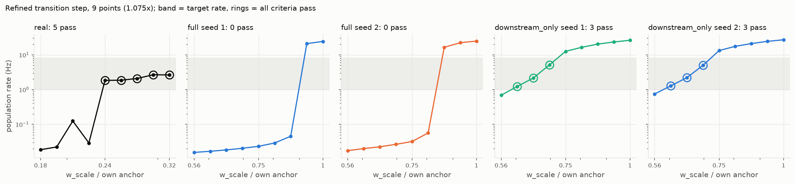

## Control 1a, refinement: a window narrower than one grid step?

`experiments/transition_refine.py`. For each graph the grid step in which the rate first reaches 1 Hz from below was re-sampled at 9 geometrically spaced w_scale values, endpoints included (1.075x steps), with the matched_regime protocol and pass conditions unchanged (every point from rest). The real graph is the positive control; its refined step ends at a grid point that already passed, so its passing there is expected, and what the control adds is the shape of its transition.

| graph | grid step (x own anchor) | points in rate band | passing points | highest rate below band | lowest rate above band | sharpest crossing (fine) | endpoints grid -> refined (Hz) |
|---|---|---|---|---|---|---|---|
| real | 0.178 - 0.316 | 5 | **5** | 0.124 Hz | n/a | 0.029 Hz @ 0.221x -> 1.83 Hz @ 0.237x | 0.0186 -> 0.0186; 2.63 -> 2.63 |
| full seed 1 | 0.562 - 1 | 0 | **0** | 0.0453 Hz | 20.9 Hz | 0.0453 Hz @ 0.866x -> 20.9 Hz @ 0.931x | 0.0155 -> 0.0155; 24.2 -> 24.2 |
| full seed 2 | 0.562 - 1 | 0 | **0** | 0.0564 Hz | 16.4 Hz | 0.0564 Hz @ 0.806x -> 16.4 Hz @ 0.866x | 0.0174 -> 0.0174; 24.8 -> 24.8 |
| downstream_only seed 1 | 0.562 - 1 | 3 | **3** | 0.688 Hz | 12.6 Hz | 0.688 Hz @ 0.562x -> 1.23 Hz @ 0.604x | 0.688 -> 0.688; 26.1 -> 26.1 |
| downstream_only seed 2 | 0.562 - 1 | 3 | **3** | 0.749 Hz | 13.2 Hz | 0.749 Hz @ 0.562x -> 1.28 Hz @ 0.604x | 0.749 -> 0.749; 27 -> 27 |

Rate curve across the step (x own anchor: rate Hz / sensory preservation / no-drive non-sensory Hz where tested):

- **real**: 0.1778x: 0.0186 / 94%; 0.1911x: 0.0223 / 95%; 0.2054x: 0.124 / 94%; 0.2207x: 0.029 / 90%; 0.2371x: 1.83 / 86% / 0 PASS; 0.2548x: 1.86 / 93% / 0 PASS; 0.2738x: 2.08 / 91% / 0 PASS; 0.2943x: 2.67 / 75% / 0 PASS; 0.3162x: 2.63 / 85% / 0 PASS
- **full seed 1**: 0.5623x: 0.0155 / 101%; 0.6043x: 0.0167 / 101%; 0.6494x: 0.0183 / 101%; 0.6978x: 0.0204 / 101%; 0.7499x: 0.0232 / 101%; 0.8058x: 0.029 / 101%; 0.866x: 0.0453 / 101%; 0.9306x: 20.9 / 161%; 1x: 24.2 / 175%
- **full seed 2**: 0.5623x: 0.0174 / 101%; 0.6043x: 0.02 / 101%; 0.6494x: 0.0225 / 101%; 0.6978x: 0.0265 / 101%; 0.7499x: 0.0318 / 101%; 0.8058x: 0.0564 / 101%; 0.866x: 16.4 / 163%; 0.9306x: 22.3 / 186%; 1x: 24.8 / 188%
- **downstream_only seed 1**: 0.5623x: 0.688 / 168%; 0.6043x: 1.23 / 172% / 0 PASS; 0.6494x: 2.15 / 177% / 0 PASS; 0.6978x: 5.13 / 187% / 0 PASS; 0.7499x: 12.6 / 190%; 0.8058x: 16.4 / 193%; 0.866x: 20.3 / 201%; 0.9306x: 23.4 / 207%; 1x: 26.1 / 214%
- **downstream_only seed 2**: 0.5623x: 0.749 / 161%; 0.6043x: 1.28 / 161% / 0 PASS; 0.6494x: 2.2 / 168% / 0 PASS; 0.6978x: 4.96 / 162% / 0 PASS; 0.7499x: 13.2 / 178%; 0.8058x: 17.5 / 195%; 0.866x: 21 / 219%; 0.9306x: 24.3 / 232%; 1x: 27 / 237%

**Result:** The claim does NOT survive as stated: 2 of 4 shuffled graphs have a passing point at 1.075x resolution: downstream_only seed 1 (3 points), downstream_only seed 2 (3 points). At this resolution these are narrow (knife-edge) windows, not absent ones.
